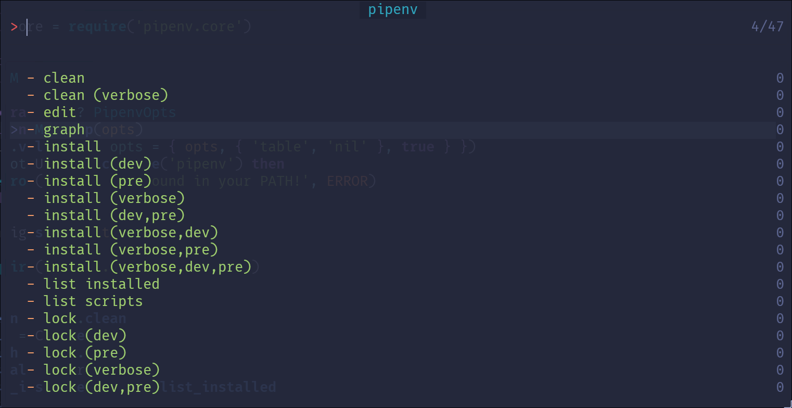

# pipenv.nvim

Asynchronous management for your Pipenv environment from within Neovim.

https://github.com/user-attachments/assets/170e9897-c501-4a33-b96a-3e266d79045d

---

## Table Of Contents

- [Installation](#installation)
  - [`lazy.nvim`](#lazynvim)
  - [`pckr.nvim`](#pckrnvim)
  - [`nvim-plug`](#nvim-plug)
  - [`paq-nvim`](#paq-nvim)
  - [LuaRocks](#luarocks)
- [Configuration](#configuration)
  - [Pipenv Environment Variables](#pipenv-environment-variables)
- [Usage](#usage)
  - [No Subcommands](#no-subcommands)
  - [Subcommands](#subcommands)
  - [`picker.nvim` Integration](#pickernvim-integration)
- [API](#api)
- [License](#license)

---

## Installation

**Requirements**

- Neovim `>=v0.9.0`
- Pipenv
- [`wsdjeg/job.nvim`](https://github.com/wsdjeg/job.nvim)
- [`xieyonn/spinner.nvim`](https://github.com/xieyonn/spinner.nvim) - **(OPTIONAL, RECOMMENDED)**
- [`wsdjeg/picker.nvim`](https://github.com/wsdjeg/picker.nvim) - **(OPTIONAL)**

### `lazy.nvim`

```lua
{
  'DrKJeff16/pipenv.nvim',
  dependencies = {
    'wsdjeg/job.nvim', -- REQUIRED!
    'xieyonn/spinner.nvim', -- RECOMMENDED
    'wsdjeg/picker.nvim', -- OPTIONAL
  },
  opts = {},
}
```

### `nvim-plug`

```lua
require('plug').add({
  {
    'DrKJeff16/pipenv.nvim',
    depends = {
      { 'wsdjeg/job.nvim' }, -- REQUIRED!
      { 'xieyonn/spinner.nvim' }, -- RECOMMENDED
      { 'wsdjeg/picker.nvim' }, -- OPTIONAL
    },
    config = function()
      require('pipenv').setup()
    end,
  }
})
```

### `pckr.nvim`

```lua
require('pckr').add({
  {
    'DrKJeff16/pipenv.nvim',
    requires = {
      'wsdjeg/job.nvim', -- REQUIRED!
      'xieyonn/spinner.nvim', -- RECOMMENDED
      'wsdjeg/picker.nvim', -- OPTIONAL
    },
    config = function()
      require('pipenv').setup()
    end,
  },
})
```

### `paq-nvim`

```lua
local paq = require('paq')
paq({
  'DrKJeff16/pipenv.nvim',
  'wsdjeg/job.nvim', -- REQUIRED!
  'xieyonn/spinner.nvim', -- RECOMMENDED
  'wsdjeg/picker.nvim', -- OPTIONAL
})
```

### LuaRocks

You can also install this plugin through LuaRocks
from [the `pipenv.nvim` module](https://luarocks.org/modules/drkjeff16/pipenv.nvim).

```bash
luarocks install pipenv.nvim         # Global Install
luarocks install --local pipenv.nvim # Local Install
```

---

## Configuration

These are the default options:

```lua
require('pipenv').setup({
  -- Output window options (`:Pipenv!`)
  output = {
    float = true, -- Set to `false` if you don't want a floating window
    split = 'right', -- right|left|above|below (only matters if `float` is `false`)
    border = 'single', -- none|single|double|rounded|solid|shadow (only matters if `float` is `true`)
    height = 0.85, -- A number between `0` and `1` (percentage) or a fixed height (only matters if `float` is `true`)
    width = 0.85, -- A number between `0` and `1` (percentage) or a fixed width (only matters if `float` is `true`)
    zindex = 100, -- The `zindex` value of the output window (only matters if `float` is `true`)
  },
  env = { -- See the `Pipenv Environment Variables` section
    -- install = {},
    -- virtual_env = {},
    -- file_location = {},
    -- security = {},
    -- behavior = {},
  },
  spinner = {
    enabled = false,
    -- See https://github.com/xieyonn/spinner.nvim for more info about these options
    opts = {
      hl_group = 'Special',
      kind = 'cursor',
      pattern = 'dots13',
      zindex = 100,
      -- attach = {},
      -- col = 0,
      -- fmt = function(event) return '' end,
      -- initial_delay_ms = 10,
      -- ns = 0,
      -- on_update_ui = function(event) end,
      -- placeholder = false,
      -- row = 0,
      -- ttl_ms = 100,
      -- ui_scope = 'Foo',
      -- winblend = 10,
    },
  },
})
```

### Pipenv Environment Variables

You can customize the environment variables used when executing Pipenv operations.
By default no option is set as to not interfere with your environment variables, but you may
modify any listed in the table below.

For more information consult the [Pipenv Documentation](https://pipenv.pypa.io/en/latest/configuration.html#available-environment-variables).


| Setup Option                          | Type      | Environment Variable            |
|---------------------------------------|-----------|---------------------------------|
| `env.behavior.auto_accept`            | `boolean` | `PIPENV_YES`                    |
| `env.behavior.clear_cache`            | `boolean` | `PIPENV_CLEAR`                  |
| `env.behavior.fancy_shell`            | `boolean` | `PIPENV_SHELL_FANCY`            |
| `env.behavior.ignore_pipfile`         | `boolean` | `PIPENV_IGNORE_PIPFILE`         |
| `env.behavior.no_asdf`                | `boolean` | `PIPENV_DONT_USE_ASDF`          |
| `env.behavior.no_load_env`            | `boolean` | `PIPENV_DONT_LOAD_ENV`          |
| `env.behavior.no_pyenv`               | `boolean` | `PIPENV_DONT_USE_PYENV`         |
| `env.behavior.no_spin`                | `boolean` | `PIPENV_NOSPIN`                 |
| `env.behavior.quiet`                  | `boolean` | `PIPENV_QUIET`                  |
| `env.behavior.requests_timeout`       | `number`  | `PIPENV_REQUESTS_TIMEOUT`       |
| `env.behavior.site_packages`          | `boolean` | `PIPENV_SITE_PACKAGES`          |
| `env.behavior.verbose`                | `boolean` | `PIPENV_VERBOSE`                |
| `env.file_location.cache_dir`         | `string`  | `PIPENV_CACHE_DIR`              |
| `env.file_location.dotenv_location`   | `string`  | `PIPENV_DOTENV_LOCATION`        |
| `env.file_location.pipfile_path`      | `string`  | `PIPENV_PIPFILE`                |
| `env.install.install_dependencies`    | `boolean` | `PIPENV_INSTALL_DEPENDENCIES`   |
| `env.install.install_timeout`         | `number`  | `PIPENV_INSTALL_TIMEOUT`        |
| `env.install.max_depth`               | `number`  | `PIPENV_MAX_DEPTH`              |
| `env.install.pypi_mirror`             | `string`  | `PIPENV_PYPI_MIRROR`            |
| `env.install.resolve_vcs`             | `boolean` | `PIPENV_RESOLVE_VCS`            |
| `env.install.skip_lock`               | `boolean` | `PIPENV_SKIP_LOCK`              |
| `env.install.timeout`                 | `number`  | `PIPENV_TIMEOUT`                |
| `env.security.pyup_api_key`           | `string`  | `PIPENV_PYUP_API_KEY`           |
| `env.virtual_env.ignore_virtual_envs` | `boolean` | `PIPENV_IGNORE_VIRTUALENVS`     |
| `env.virtual_env.python_path`         | `string`  | `PIPENV_PYTHON`                 |
| `env.virtual_env.python_version`      | `string`  | `PIPENV_DEFAULT_PYTHON_VERSION` |
| `env.virtual_env.venv_in_project`     | `boolean` | `PIPENV_VENV_IN_PROJECT`        |
| `env.virtual_env.venv_name`           | `string`  | `PIPENV_CUSTOM_VENV_NAME`       |
| `env.virtual_env.venv_path`           | `string`  | `PIPENV_VIRTUALENV`             |

Example:

```lua
-- ARBITRARY EXAMPLE. DO NOT COPY AS-IS!
require('pipenv').setup({
  env = {
    behavior = {
      auto_accept = true,
      ignore_pipfile = true,
    },
    file_location = {
      cache_dir = vim.fn.expand('~/.local/state/pipenv/cache'),
    },
    install = {
      install_dependencies = false,
      resolve_vcs = true,
    },
    security = {
      pyup_api_key = '<API_KEY>',
    },
    virtual_env = {
      venv_name = 'my_venv',
      venv_path = vim.fn.expand('~/.cache/my-virtualenv'),
    },
  },
})
```

---

## Usage

You can use the `:Pipenv` command to do certain operations with Pipenv from within Neovim.

To enable verbose mode in any operation simply add a `!` to the command (`:Pipenv!`).

You can also pass these flags:

- `dev=true|false` - The command is called with a `--dev` flag.
- `pre=true|false` - The command is called with a `--pre` flag.
- `file=/path/to/file` - The command output will be written to the target `file`.
- `python=PYTHON_VERSION` - The python version for Pipenv to use. Must be formatted correctly
  (e.g. `python=3.10`, `python=3.13`, ...).

Keep in mind that any flag that doesn't get parsed by a subcommand can still be passed,
only it won't make a difference!

The valid subcommands are:

- `clean`
- `edit`
- `graph`
- `help`
- `install`
- `list-installed`
- `list-scripts`
- `lock`
- `remove` (calling `:Pipenv! remove` will force its execution instead of enabling verbose mode)
- `requirements`
- `run`
- `scripts`
- `sync`
- `uninstall`
- `update`
- `upgrade`
- `verify`

### No Subcommands

<div align="center">
  <table>
    <tr>
      <td>
        <p align="center">
          <a href="#no-subcommands">
            
          </a>
          <br />
          <em>The UI spawned when running without subcommands.</em>
        </p>
      </td>
    </tr>
  </table>
</div>

You can run `:Pipenv[!]` without any of the subcommands listed above. This will open a UI
prompting to do any of the valid Pipenv operations.

Keep in mind flags can still be passed to achieve the same effect
for any operation that requires it.

Examples:

```vim
:Pipenv                              " verbose=false, dev=false, pre=false, file=nil, python=nil
:Pipenv python=3.10                  " verbose=false, dev=false, pre=false, file=nil, python=3.10
:Pipenv!                             " verbose=true, dev=false, pre=false, file=nil, python=nil
:Pipenv! dev=true file=/path/to/file " verbose=true, dev=true, pre=false, file=/path/to/file, python=nil
:Pipenv dev=true pre=false           " verbose=false, dev=true, pre=true, file=nil, python=nil
```

### Subcommands

Below is a table specifying each subcommand, how many arguments does it take,
what flags are valid for parsing and its description.

| Subcommand       | Nargs | Verbose | Dev | Pre | File | Python | Description                                                            |
|------------------|-------|---------|-----|-----|------|--------|------------------------------------------------------------------------|
| `help`           | `0`   | 󰅖       | 󰅖   | 󰅖   | 󰅖    | 󰅖      | Prints the usage message                                               |
| `edit`           | `0`   | 󰅖       | 󰅖   | 󰅖   | 󰅖    | 󰅖      | Edit the `Pipfile` or create a blank one if none exists                |
| `list-installed` | `0`   | 󰅖       | 󰅖   | 󰅖   | 󰅖    | 󰅖      | Lists the installed packages in a window                               |
| `list-scripts`   | `0`   | 󰅖       | 󰅖   | 󰅖   | 󰅖    | 󰅖      | Lists the defined scripts in the Pipfile                               |
| `graph`          | `*`   | 󰅖       | 󰅖   | 󰅖   | 󰅖    | 󰄬      | Returns the output of `pipenv [--python <VERSION>] graph`              |
| `clean`          | `*`   | 󰄬       | 󰅖   | 󰅖   | 󰅖    | 󰄬      | Runs `pipenv [--python <VERSION>] clean`                               |
| `install`        | `*`   | 󰄬       | 󰄬   | 󰄬   | 󰅖    | 󰄬      | Runs `pipenv [--python <VERSION>] install [--dev] [ARGS...] [--pre]`   |
| `lock`           | `*`   | 󰄬       | 󰄬   | 󰄬   | 󰅖    | 󰄬      | Runs `pipenv [--python <VERSION>] lock [--dev] [--pre]`                |
| `requirements`   | `*`   | 󰄬       | 󰄬   | 󰅖   | 󰄬    | 󰄬      | Runs `pipenv [--python <VERSION>] requirements [--dev]`                |
| `run`            | `+`   | 󰄬       | 󰅖   | 󰅖   | 󰅖    | 󰄬      | Runs `pipenv [--python <VERSION>] run ...`                             |
| `scripts`        | `*`   | 󰅖       | 󰅖   | 󰅖   | 󰅖    | 󰄬      | Returns the output of `pipenv [--python <VERSION>] scripts`            |
| `sync`           | `*`   | 󰄬       | 󰄬   | 󰄬   | 󰅖    | 󰄬      | Runs `pipenv [--python <VERSION>] sync [--dev] [--pre]`                |
| `uninstall`      | `*`   | 󰄬       | 󰄬   | 󰄬   | 󰅖    | 󰄬      | Runs `pipenv [--python <VERSION>] uninstall [--dev] [--pre] [ARGS...]` |
| `update`         | `*`   | 󰄬       | 󰄬   | 󰄬   | 󰅖    | 󰄬      | Runs `pipenv [--python <VERSION>] update [--dev] [--pre]`              |
| `upgrade`        | `*`   | 󰄬       | 󰄬   | 󰄬   | 󰅖    | 󰄬      | Runs `pipenv [--python <VERSION>] upgrade [--dev] [--pre]`             |
| `verify`         | `*`   | 󰄬       | 󰅖   | 󰅖   | 󰅖    | 󰄬      | Runs `pipenv [--python <VERSION>] verify`                              |

Examples:

```vim
:Pipenv run <COMMANDS>                            " verbose=false
:Pipenv! run <COMMANDS>                           " verbose=true

:Pipenv! edit                                     " The verbose flag doesn't matter

:Pipenv! sync dev=true                            " verbose=true, dev=false
:Pipenv! dev=true sync                            " Same as above

:Pipenv pre=true install ...                      " Installs prerelease packages

:Pipenv! python=3.13 install <PACKAGES>           " verbose=true, python=3.13

:Pipenv dev=true file=/path/to/file requirements  " verbose=false, dev=true, file=/path/to/file
```

Note that the `remove` subcommand only supports a bang (`!`) and treats it as "force" instead of
"verbose":

| Subcommand | Nargs | Force | Dev | Pre | File | Python | Description                                                                                                            |
|------------|-------|-------|-----|-----|------|--------|------------------------------------------------------------------------------------------------------------------------|
| `remove`   | `0`   | 󰄬     | 󰅖   | 󰅖   | 󰅖    | 󰅖      | Prompts to run `pipenv --rm` and optionally removes your `Pipfile`. **If called with a bang you will not be prompted** |

Examples:

```vim
:Pipenv remove     " force=false, you will be prompted
:Pipenv! remove    " force=true, you will NOT be prompted
```

### `picker.nvim` Integration



This plugin has a (rather rough) integration with
[`wsdjeg/picker.nvim`](https://github.com/wsdjeg/picker.nvim). If you have it installed you can
run `:Picker pipenv` to use it.

---

## API

Most of the API is publicly available on the main module
[`pipenv.lua`](https://github.com/DrKJeff16/pipenv.nvim/blob/main/lua/pipenv.lua), which imports the
utilities from [`core.lua`](https://github.com/DrKJeff16/pipenv.nvim/blob/main/lua/pipenv/core.lua).

The operations used by the `:Pipenv` user command are the following:

| Subcommand               | Core Function Called                      |
|--------------------------|-------------------------------------------|
| `:Pipenv clean`          | `require('pipenv.core').clean()`          |
| `:Pipenv edit`           | `require('pipenv.core').edit()`           |
| `:Pipenv graph`          | `require('pipenv.core').graph()`          |
| `:Pipenv install`        | `require('pipenv.core').install()`        |
| `:Pipenv list-installed` | `require('pipenv.core').list_installed()` |
| `:Pipenv list-scripts`   | `require('pipenv.core').list_scripts()`   |
| `:Pipenv lock`           | `require('pipenv.core').lock()`           |
| `:Pipenv requirements`   | `require('pipenv.core').requirements()`   |
| `:Pipenv remove`         | `require('pipenv.core').remove()`         |
| `:Pipenv run`            | `require('pipenv.core').run()`            |
| `:Pipenv scripts`        | `require('pipenv.core').scripts()`        |
| `:Pipenv sync`           | `require('pipenv.core').sync()`           |
| `:Pipenv uninstall`      | `require('pipenv.core').uninstall()`      |
| `:Pipenv update`         | `require('pipenv.core').update()`         |
| `:Pipenv upgrade`        | `require('pipenv.core').upgrade()`        |
| `:Pipenv verify`         | `require('pipenv.core').verify()`         |

---

## License

[MIT](https://github.com/DrKJeff16/pipenv.nvim/blob/main/LICENSE)

<!-- vim: set ts=2 sts=2 sw=2 et ai si sta: -->
